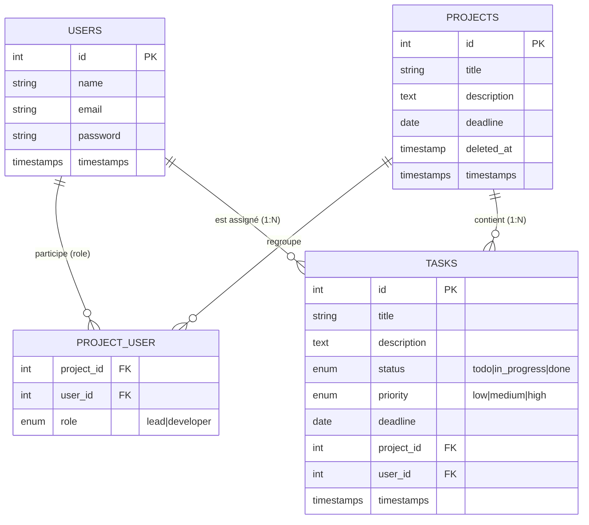
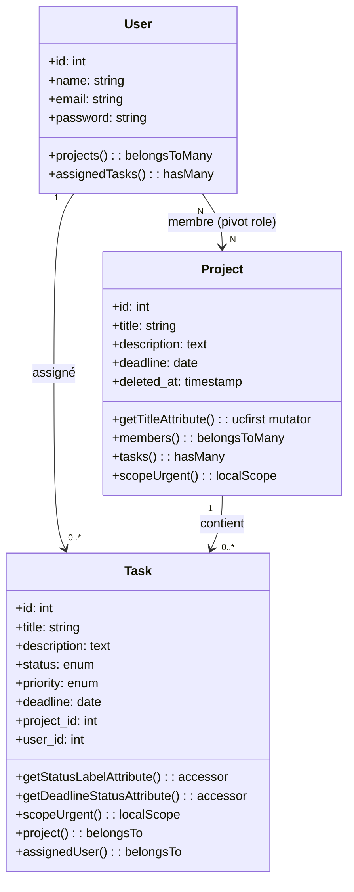
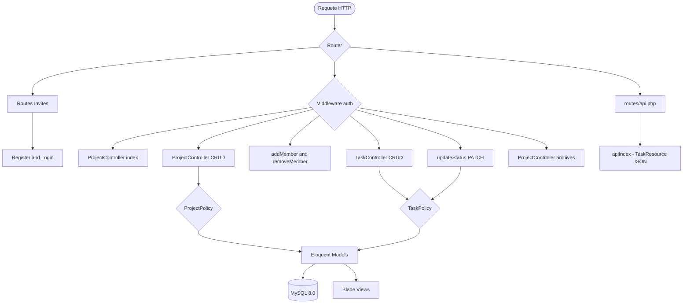

# 📋 MicroAgile — Lightweight Project & Task Manager for Dev Teams

Application web de gestion de projets et de tâches pour équipes de développement, développée avec Laravel. MicroAgile permet à un **Team Lead** de créer des projets, d'inviter des développeurs, et d'assigner des tâches. Les **développeurs** voient uniquement les projets dont ils font partie et mettent à jour le statut de leurs propres tâches. Pense mini Jira — sans la complexité.

---

## 🚀 Fonctionnalités Clés

- **Deux Rôles Distincts** : Team Lead (gestion complète) et Developer (lecture + changement de statut).
- **Authentification Complète** : Inscription, Connexion et Déconnexion sécurisées.
- **Gestion des Projets (CRUD)** : Création, modification, archivage et restauration de projets avec titre, description et deadline.
- **Gestion des Membres** : Ajout et retrait de développeurs par email depuis la page projet.
- **Gestion des Tâches (CRUD)** : Création, modification et suppression de tâches avec titre, description, deadline, priorité (low / medium / high) et assignation à un membre.
- **Changement de Statut** : Les développeurs assignés font progresser leur tâche `todo → in_progress → done`.
- **Indicateur d'Urgence** : Les tâches dont la deadline est dans moins de 48h sont signalées visuellement.
- **Archive & Restauration** : Les projets archivés disparaissent du dashboard principal mais restent accessibles dans la section Archives.
- **Endpoint API REST** : `GET /api/projects/{project}/tasks` retourne les tâches en JSON formaté via une `TaskResource`.
- **Outils de Debugging** : Intégration complète de Laravel Debugbar et Laravel Telescope pour le monitoring et le suivi des requêtes.

---

## 🏗️ Architecture & Conception

### 📊 Schéma Entité-Relation



### 📋 Tables de la Base de Données

1. **USERS** (**id** INT PK, name VARCHAR(255), email VARCHAR(255) UNIQUE, password VARCHAR(255), created_at, updated_at)
.
2. **PROJECTS** (**id** INT PK, title VARCHAR(255), description TEXT, deadline DATE, deleted_at TIMESTAMP NULL, created_at, updated_at)
.
3. **PROJECT_USER** (**project_id** INT FK → projects.id, **user_id** INT FK → users.id, role ENUM('lead','developer')) — *Table pivot Many-to-Many*
.
4. **TASKS** (**id** INT PK, title VARCHAR(255), description TEXT, status ENUM('todo','in_progress','done') DEFAULT 'todo', priority ENUM('low','medium','high') DEFAULT 'medium', deadline DATE, project_id INT FK → projects.id, user_id INT FK → users.id, created_at, updated_at)

### 🗺️ Diagramme de Classes



### 🔄 Routing Flow



### 🔐 Autorisation — Policies

| Action | Lead | Developer assigné | Developer non assigné |
|---|:---:|:---:|:---:|
| Voir un projet (membre) | ✅ | ✅ | ❌ |
| Créer / Modifier / Archiver un projet | ✅ | ❌ | ❌ |
| Ajouter / Retirer un membre | ✅ | ❌ | ❌ |
| Créer / Modifier / Supprimer une tâche | ✅ | ❌ | ❌ |
| Changer le statut d'une tâche | ✅ | ✅ | ❌ |

---

## 📂 Structure du Projet

```bash
microagile/
├── compose.yaml                          # Services : laravel.test (app), mysql, phpmyadmin
├── app/
│   ├── Http/
│   │   ├── Controllers/
│   │   │   ├── ProjectController.php     # CRUD + archive + restore + membres
│   │   │   ├── TaskController.php        # CRUD + changement statut + API endpoint
│   │   │   └── Auth/                     # Login, Register, Logout
│   │   ├── Requests/
│   │   │   ├── StoreProjectRequest.php   # Validation création projet
│   │   │   ├── UpdateProjectRequest.php  # Validation modification projet
│   │   │   ├── StoreTaskRequest.php      # Validation création tâche
│   │   │   └── UpdateTaskRequest.php     # Validation modification tâche
│   │   └── Resources/
│   │       └── TaskResource.php          # JSON formatting pour l'API
│   ├── Models/
│   │   ├── Project.php                   # SoftDeletes · belongsToMany · ucfirst mutator
│   │   ├── Task.php                      # Accessors status_label & deadline_status · scope urgent
│   │   └── User.php                      # belongsToMany projects · hasMany tasks
│   └── Policies/
│       ├── ProjectPolicy.php             # Autorisations sur les projets
│       └── TaskPolicy.php               # Autorisations sur les tâches
├── database/
│   ├── migrations/                       # Tables users, projects, project_user, tasks
│   └── seeders/                          # Données de test (users, projets, tâches)
├── resources/views/
│   ├── layouts/
│   │   └── app.blade.php                 # Layout principal (@auth / @guest / @can)
│   ├── projects/
│   │   ├── index.blade.php               # Dashboard — liste des projets actifs
│   │   ├── create.blade.php              # Formulaire création projet
│   │   ├── edit.blade.php                # Formulaire modification projet
│   │   ├── show.blade.php                # Détail projet + liste tâches
│   │   └── archives.blade.php            # Section archives
│   ├── tasks/
│   │   ├── create.blade.php              # Formulaire création tâche
│   │   └── edit.blade.php                # Formulaire modification tâche
│   └── auth/
│       ├── login.blade.php
│       └── register.blade.php
├── routes/
│   ├── web.php                           # Routes nommées groupées sous middleware auth
│   └── api.php                           # Endpoint API tâches
└── README.md
```

---

## 🛠️ Installation & Setup

### Prérequis

- PHP >= 8.2
- Composer
- Docker Desktop (pour Laravel Sail)
- Git

### 1. Cloner le dépôt

```bash
git clone https://github.com/<votre-pseudo>/microagile.git
cd microagile
```

### 2. Copier le fichier d'environnement

```bash
cp .env.example .env
```

Vérifiez que les variables suivantes correspondent à votre configuration Docker :

```env
DB_CONNECTION=mysql
DB_HOST=mysql
DB_PORT=3306
DB_DATABASE=microagile
DB_USERNAME=sail
DB_PASSWORD=password
```

### 3. Installer les dépendances PHP

```bash
docker run --rm \
    -u "$(id -u):$(id -g)" \
    -v "$(pwd):/var/www/html" \
    -w /var/www/html \
    laravelsail/php82-composer:latest \
    composer install --ignore-platform-reqs
```

### 4. Lancer l'environnement Docker (Sail)

```bash
./vendor/bin/sail up -d
```

> 💡 Ajoutez un alias pour plus de confort : `alias sail='./vendor/bin/sail'`

### 5. Générer la clé d'application

```bash
./vendor/bin/sail artisan key:generate
```

### 6. Initialiser la base de données

```bash
./vendor/bin/sail artisan migrate:fresh --seed
```

Cette commande crée toutes les tables et insère des données de test : utilisateurs, projets et tâches.

### 7. Accéder à l'application

| Service | URL |
|---|---|
| Application | [http://localhost](http://localhost) |
| phpMyAdmin | [http://localhost:8081](http://localhost:8081) |
| Telescope | [http://localhost/telescope](http://localhost/telescope) |

---

## 🗺️ Table des Routes

### Routes Web (Protégées par `auth`)

| Méthode | URI | Nom | Controller | Rôle requis |
|---|---|---|---|---|
| GET | `/register` | `register` | `Auth\RegisterController@show` | — |
| POST | `/register` | — | `Auth\RegisterController@store` | — |
| GET | `/login` | `login` | `Auth\LoginController@show` | — |
| POST | `/login` | — | `Auth\LoginController@login` | — |
| POST | `/logout` | `logout` | `Auth\LoginController@logout` | Connecté |
| GET | `/dashboard` | `projects.index` | `ProjectController@index` | Connecté |
| GET | `/projects/create` | `projects.create` | `ProjectController@create` | Lead |
| POST | `/projects` | `projects.store` | `ProjectController@store` | Lead |
| GET | `/projects/{project}` | `projects.show` | `ProjectController@show` | Membre |
| GET | `/projects/{project}/edit` | `projects.edit` | `ProjectController@edit` | Lead |
| PUT | `/projects/{project}` | `projects.update` | `ProjectController@update` | Lead |
| PATCH | `/projects/{project}/archive` | `projects.archive` | `ProjectController@archive` | Lead |
| PATCH | `/projects/{project}/restore` | `projects.restore` | `ProjectController@restore` | Lead |
| DELETE | `/projects/{project}` | `projects.destroy` | `ProjectController@destroy` | Lead |
| GET | `/projects/archives` | `projects.archives` | `ProjectController@archives` | Lead |
| POST | `/projects/{project}/members` | `projects.members.add` | `ProjectController@addMember` | Lead |
| DELETE | `/projects/{project}/members/{user}` | `projects.members.remove` | `ProjectController@removeMember` | Lead |
| GET | `/projects/{project}/tasks/create` | `tasks.create` | `TaskController@create` | Lead |
| POST | `/projects/{project}/tasks` | `tasks.store` | `TaskController@store` | Lead |
| GET | `/tasks/{task}/edit` | `tasks.edit` | `TaskController@edit` | Lead |
| PUT | `/tasks/{task}` | `tasks.update` | `TaskController@update` | Lead |
| PATCH | `/tasks/{task}/status` | `tasks.status` | `TaskController@updateStatus` | Assigné |
| DELETE | `/tasks/{task}` | `tasks.destroy` | `TaskController@destroy` | Lead |

### Routes API

| Méthode | URI | Controller | Format |
|---|---|---|---|
| GET | `/api/projects/{project}/tasks` | `TaskController@apiIndex` | JSON (TaskResource) |

**Exemple de réponse API :**

```json
{
  "data": [
    {
      "id": 1,
      "title": "Configurer l'authentification",
      "description": "Mettre en place login et register",
      "status": "in_progress",
      "status_label": "En cours",
      "priority": "high",
      "deadline": "2026-05-08",
      "deadline_status": "urgent",
      "assigned_to": "Ali Benali"
    }
  ]
}
```

---

## 🧩 Concepts Techniques Clés

### Soft Deletes — Archivage de projets

Le modèle `Project` utilise le trait `SoftDeletes`. Archiver un projet appelle `$project->delete()` (remplit `deleted_at`). Restaurer appelle `$project->restore()`. La suppression définitive utilise `$project->forceDelete()`.

```php
// Project.php
use Illuminate\Database\Eloquent\SoftDeletes;

class Project extends Model
{
    use SoftDeletes;
}
```

### Accessors — Formatage des données

Deux accessors sont définis sur le modèle `Task` et utilisés dans les vues Blade et dans la `TaskResource` :

```php
// Task.php

// Retourne le statut formaté en français
public function getStatusLabelAttribute(): string
{
    return match($this->status) {
        'todo'        => 'À faire',
        'in_progress' => 'En cours',
        'done'        => 'Terminé',
    };
}

// Retourne 'urgent', 'soon' ou 'ok' selon la deadline
public function getDeadlineStatusAttribute(): string
{
    if (!$this->deadline || $this->status === 'done') return 'ok';
    $hours = now()->diffInHours($this->deadline, false);
    if ($hours < 0)  return 'overdue';
    if ($hours < 48) return 'urgent';
    return 'ok';
}
```

### Mutator — Titre en ucfirst

Le modèle `Project` applique automatiquement `ucfirst()` à chaque titre à l'écriture :

```php
// Project.php
public function setTitleAttribute(string $value): void
{
    $this->attributes['title'] = ucfirst($value);
}
```

### Local Scope — Tâches urgentes

```php
// Task.php
public function scopeUrgent(Builder $query): Builder
{
    return $query->where('status', '!=', 'done')
                 ->where('deadline', '<=', now()->addHours(48));
}
```

### Many-to-Many avec colonne role

```php
// User.php
public function projects(): BelongsToMany
{
    return $this->belongsToMany(Project::class)->withPivot('role')->withTimestamps();
}

// Vérifier le rôle dans le controller ou la Policy
$user->projects()->where('project_id', $project->id)->wherePivot('role', 'lead')->exists();
```

---

## 🧪 Vérifications Qualité

- **Autorisation (Policies)** : `ProjectPolicy` et `TaskPolicy` gèrent toutes les autorisations. `$this->authorize()` est appelé dans chaque controller. Zéro `abort(403)` manuel dans le code.
- **Validation (Form Requests)** : Toutes les entrées utilisateur passent par une classe `FormRequest` dédiée. Zéro `$request->validate()` inline dans les controllers.
- **N+1 Query** : Utilisation systématique de l'Eager Loading (`with()`) sur toutes les relations. Vérifié et validé avec Laravel Debugbar.
- **CSRF** : Directive `@csrf` présente sur tous les formulaires.
- **Sécurité des Routes** : Toutes les routes sensibles sont groupées sous le middleware `auth` et redirigent vers `/login` si non connecté.
- **UX urgence** : Les tâches dont la deadline est dans moins de 48h s'affichent avec un indicateur visuel d'urgence.

---

## 📄 Licence

Distribué sous licence Unlicensed — usage interne uniquement.


## 🧪 Tests

Pour exécuter la suite de tests Laravel dans cet environnement Docker, utilisez l'une des commandes suivantes :

- Exécuter tous les tests :
  ```bash
  ./vendor/bin/sail test
  ```
- Exécuter uniquement les tests de fonctionnalité CRUD et N+1 :
  ```bash
  ./vendor/bin/sail test --filter 'ProjectCrudTest|TaskCrudTest|NPlusOneTest'
  ```
- Exécuter un test spécifique :
  ```bash
  ./vendor/bin/sail test --filter ProjectCrudTest
  ```

Si vous préférez exécuter PHPUnit directement dans le conteneur :

```bash
docker compose exec laravel.test php artisan test
```

> ⚠️ Ne lancez pas `./vendor/bin/phpunit` directement depuis l'hôte si le conteneur Docker n'est pas actif, car la base de données `mysql` est configurée pour fonctionner dans le réseau Docker.
